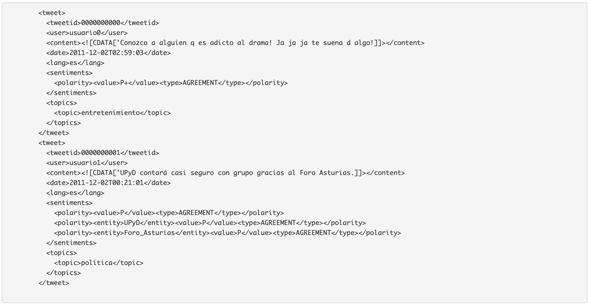
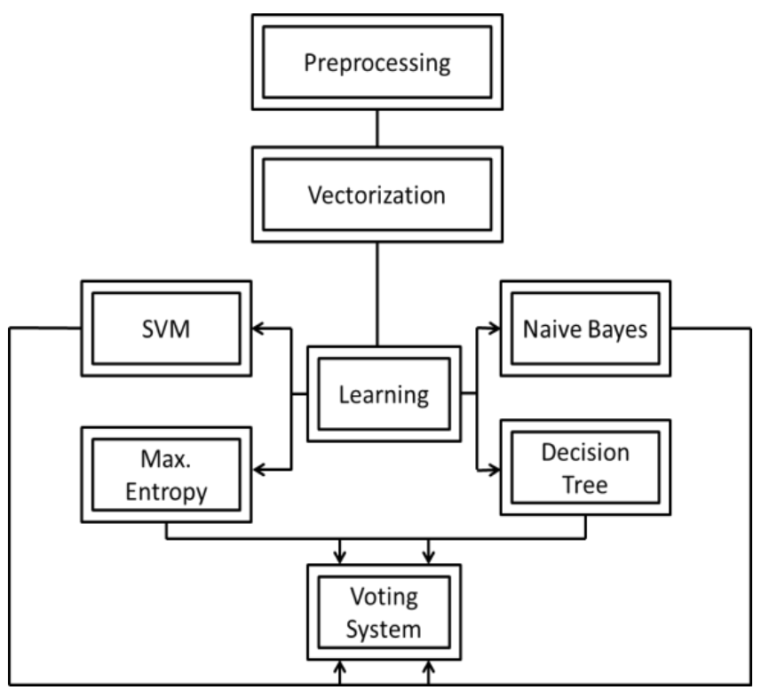

# SentimentAnalyzer
Sentiment analyzer for Spanish documents using supervised and non-supervised classifiers. Here I implemented a set of experiments to address the global polarity classification task of Spanish Tweets of TASS 2015 at XXXI Congress of the Spanish Society for Natural Language Processing. I compared the main supervised classification algorithms for Sentiment Analysis.

## Dataset
The corpus contains over 68 000 Twitter messages, written in Spanish by about 150 well-known personalities and celebrities of the world of politics, economy, communication, mass media, and culture. Each message is tagged with its global polarity, indicating whether the text expresses a positive, negative, or neutral sentiment, or no sentiment at all. A set of 6 labels has been defined: strong positive (P+), positive (P), neutral (NEU), negative (N), strong negative (N+) and one additional no-sentiment tag (NONE). As follows is shown an example of the dataset:

## Methodology

## Main results
aa

## References
[Comparing supervised learning methods for classifying Spanish tweets](https://ceur-ws.org/Vol-1397/sanpablo.pdf). J Valverde, J Tejada, E Cuadros. TASS SEPLN, CEUR workshop proceedings 1397, 87-92
