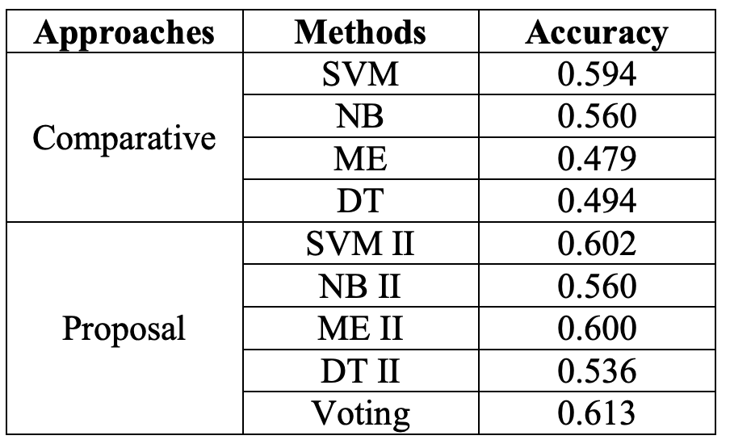

# Sentiment Analyzer
Sentiment analyzer for Spanish documents using supervised and non-supervised classifiers. Here I implemented a set of experiments to address the global polarity classification task of Spanish Tweets of TASS 2015 at XXXI Congress of the Spanish Society for Natural Language Processing. I compared the main supervised classification algorithms for Sentiment Analysis.

## Dataset
The corpus contains over 68 000 Twitter messages, written in Spanish by about 150 well-known personalities and celebrities of the world of politics, economy, communication, mass media, and culture. Each message is tagged with its global polarity, indicating whether the text expresses a positive, negative, or neutral sentiment, or no sentiment at all. A set of 6 labels has been defined: strong positive (P+), positive (P), neutral (NEU), negative (N), strong negative (N+) and one additional no-sentiment tag (NONE). As follows is shown an example of the dataset:

## Methodology
In this work, I compared some supervised classification methods in order to determine the performance of these algorithms in a set of opinions written by Spanish users. For the experiments I used the following supervised classifiers: Support Vector Machines, Naive Bayes, Maximum Entropy and Decision Trees.  I also proposed to improve the performance of these classifiers using a class reduction technique and then a voting algorithm called Naive Voting. In this technique, which has as input parameters the four classifiers, the opinion is classified according to the majority agreement, i.e., the class with most votes in each classifier will be the winning class. The architecture of this system is shown in the next figure: 

## Main results
I used the corpora provided by the organization of  [TASS 2015](http://tass.sepln.org/2015/tass2015.php). I performed a series of tests to address the Task 1 of TASS 2015, focusing on finding the global polarity of the Tweets corpora for 4 class labels (P, N, NEU, NONE). I evaluated the accuracy obtained for each proposed approach. The main results are shown in the following table:  

## References
[Comparing supervised learning methods for classifying Spanish tweets](https://ceur-ws.org/Vol-1397/sanpablo.pdf). J Valverde, J Tejada, E Cuadros. TASS SEPLN, CEUR workshop proceedings 1397, 87-92
